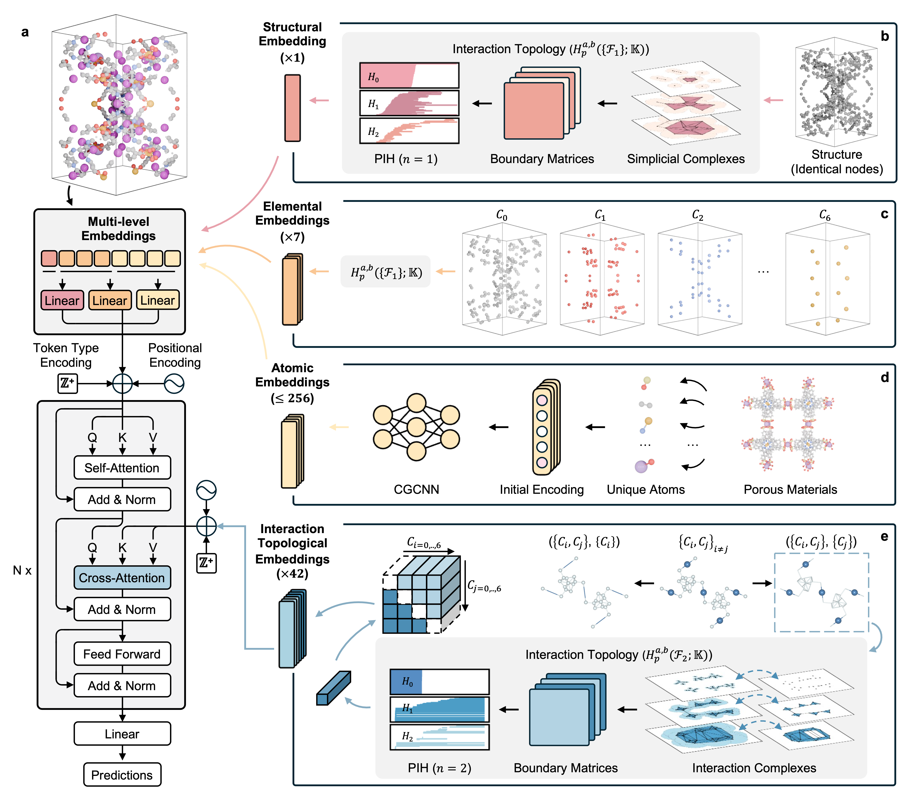

# ITTransformer

**Interaction Topological Transformer for Multiscale Learning in Porous Materials**

**Authors**: Dong Chen, Jian Liu, Chun-Long Chen, and Guo-Wei Wei

---

## Table of Contents

- [ITTransformer](#ittransformer)
  - [Table of Contents](#table-of-contents)
  - [Introduction](#introduction)
  - [Model Framework](#model-framework)
  - [Installation](#installation)
    - [1. Clone the repository](#1-clone-the-repository)
    - [2. Create a conda environment](#2-create-a-conda-environment)
    - [3. Install ITTransformer](#3-install-ittransformer)
  - [Usage](#usage)
    - [1. Data Preprocessing](#1-data-preprocessing)
    - [2. Pretraining](#2-pretraining)
    - [3. Fine-Tuning](#3-fine-tuning)
    - [4. Prediction](#4-prediction)
    - [5. Extract the Latent Features (Optional)](#5-extract-the-latent-features-optional)
  - [Open Resources](#open-resources)
    - [1. Datasets](#1-datasets)
    - [2. Pretrained Model](#2-pretrained-model)
    - [3. Downstream Models and Predictions](#3-downstream-models-and-predictions)
  - [Contributors](#contributors)

---

## Introduction

This repository contains the source code for the **Interaction Topological Transformer (ITT)**, a deep learning framework for predicting properties of porous materials, including **MOFs, COFs, PPNs, and ZEOs**.

**Keywords**: interaction topology, persistent interaction homology, porous materials, transformer.

---

## Model Framework

<!--  -->


---

## Installation

### 1. Clone the repository

```bash
git clone https://github.com/WeilabMSU/ITTransformer.git
cd ITTransformer
```

### 2. Create a conda environment

You can reproduce the environment using the provided `environment.yml`. By default, the environment will be created with the name `ITT_env`:

```bash
conda env create -f environment.yml
conda activate ITT_env
```

### 3. Install ITTransformer

Install the package in editable mode:

```bash
pip install -e .
```

---

## Usage

### 1. Data Preprocessing

* `input_path`: Path to input CIF file, directory, or folder of `.npz` files for combining.
* `--output-file`: Path to save the generated features as a `.npz` file.

```bash
# Minimal example
python scripts/func_generate_pih_initial_graph.py \
    examples/example_cifs/ABEYEN_clean.cif \
    --output-file examples/example_out/ABEYEN_clean.npz
```

---

### 2. Pretraining

Required arguments:

* `--pretraining-data`: Path to `.tar` file containing all feature `.npz` files.
* `--label-csv`: CSV file with feature file IDs corresponding to `.tar` entries, with header `id`.
* `--feature-scaler`: Precomputed scaler to standardize features across the dataset.
  * The feature scaler can be generated using the functions `fit_and_save_feature_scaler_tar_incremental` (for large datasets) and `fit_and_save_feature_scaler_tar` in `main/itt/utils.py` for the given dataset.

```bash
python -u main/pretrained_masked_LM_task.py \
    --pretraining-data data/pretrain_features.tar \
    --label-csv examples/example_id_for_pretrain.csv \
    --save-path examples/example_out \
    --epochs 10 \
    --batch-size 16 \
    --standardize-features \
    --feature-scaler main/itt/feature_scaler_from_pretrained_data.sav \
    --print-freq 2 \
    --lr 0.0001 \
    --num-workers 2 \
    --mask-ratio 0.5
```

---

### 3. Fine-Tuning

Required arguments:

* `--features-folder`: Path to folder of feature `.npz` files.
* `--label-csv`: Two-column CSV file: `[file_id, label]` (no header).
* `--pretrained-model`: Path to pretrained model checkpoint (optional).
* `--save-top-n`: Number of best checkpoints to keep (default: 1), which will be used for ensemble prediction during testing.
* `--num-labels`: Number of labels (1 for regression).

**Regression task**

```bash
python -u main/finetune_task.py \
    --features-folder examples/example_npzs \
    --label-csv examples/example_id_label_regression.csv \
    --save-path examples/example_out \
    --epochs 10 \
    --batch-size 32 \
    --standardize-labels \
    --standardize-features \
    --feature-scaler main/itt/feature_scaler_from_pretrained_data.sav \
    --lr 0.0001 \
    --save-top-n 5 \
    --random-seed 42
```

**Classification task**

```bash
python -u main/finetune_task.py \
    --features-folder examples/example_npzs \
    --label-csv examples/example_id_label_classification.csv \
    --save-path examples/example_out \
    --num-labels 3 \
    --epochs 10 \
    --batch-size 32 \
    --standardize-labels \
    --standardize-features \
    --feature-scaler main/itt/feature_scaler_from_pretrained_data.sav \
    --lr 0.0001 \
    --save-top-n 5 \
    --random-seed 42
```

---

### 4. Prediction

* `--features-folder`: Path to feature `.npz` files.
* `--label-csv`: CSV file with file IDs and labels (no header); the second column contains labels, which can be random numbers.
* `--model-paths`: Path(s) for one or more model checkpoints.

**Regression task**

```bash
python -u main/finetune_task.py \
    --features-folder examples/example_npzs \
    --label-csv examples/example_id_label_classification.csv \
    --model-paths examples/example_out/model_best.pth.tar \
    --feature-scaler main/itt/feature_scaler_from_pretrained_data.sav \
    --task regression \
    --output-csv examples/example_out/out_predictions_regression.csv
```

**Classification task**

```bash
python -u main/finetune_task.py \
    --features-folder examples/example_npzs \
    --label-csv examples/example_id_label_classification.csv \
    --model-paths examples/example_out/model_best.pth.tar \
    --feature-scaler main/itt/feature_scaler_from_pretrained_data.sav \
    --task classification \
    --num-labels 2 \
    --output-csv examples/example_out/out_predictions_classification.csv
```

---

### 5. Extract the Latent Features (Optional)

Generate latent embeddings for analysis.

```bash
python -u main/generate_embedding_task.py \
    --model-path examples/example_out/model_best.pth.tar \
    --features-folder examples/example_npzs \
    --label-csv datasets/O2N2_Selfdiffusion.csv \
    --output-path examples/example_out/embeddings.npy \
    --embedding-type cls \
    --batch-size 128 \
    --standardize-features \
    --feature-scaler main/itt/feature_scaler_from_pretrained_data.sav \
    --model-type pretrained
```

---

## Open Resources

### 1. Datasets


| Purpose             | Dataset   | Size  | Properties Used                                              |
|---------------------|-----------|-------|--------------------------------------------------------------|
| Pretraining         | ARC-MOF   | 520,835 | MOF structures only                                          |
|                     | MC-COF    | 69,840  | COF structures only (Materials Cloud)                        |
|                     | CoRE-COF  | 1,242   | COF structures only (CoRE-COF version 7)                     |
|                     | PPN       | 10,237  | Amorphous PPN structures only                                |
|                     | IZA-SC    | 242     | Zeolite structures only                                      |
| Downstream (MOFs)   | Henry's constant of N₂ (mol/kg/Pa) | 4,744 | Henry constant for N₂ |
|                     | Henry's constant of O₂ (mol/kg/Pa) | 5,036 | Henry constant for O₂ |
|                     | N₂ uptake (mol/kg)                 | 5,132 | Uptake for N₂          |
|                     | O₂ uptake (mol/kg)                 | 5,241 | Uptake for O₂          |
|                     | Self-diffusivity of N₂ at 1 bar (cm²/s) | 5,056 | Self-diffusivity for N₂ at 1 bar |
|                     | Self-diffusivity of N₂ at infinite dilution (cm²/s) | 5,192 | Self-diffusivity for N₂ at infinite dilution |
|                     | Self-diffusivity of O₂ at 1 bar (cm²/s) | 5,223 | Self-diffusivity for O₂ at 1 bar |
|                     | Self-diffusivity of O₂ at infinite dilution (cm²/s) | 5,097 | Self-diffusivity for O₂ at infinite dilution |
|                     | SRS       | 2,179   | Solvent-removal stability (binary classification)            |
|                     | TST       | 3,132   | Thermal stability temperature (K)                            |
|                     | QMOF-BD   | 20,375  | Bandgap (eV)                                                 |
|                     | CO₂–Henry | 9,525   | CO₂ Henry constant (log k_H; k_H in mol·kg⁻¹·Pa⁻¹)           |
| Downstream (COFs)   | MC-COF    | 69,840  | CH₄ uptake at 65 bar and 5.8 bar (cm³(STP)·cm⁻³)             |
| Downstream (PPNs)   | hPPN      | 17,846  | CH₄ uptake at 1 bar and 65 bar (cm³(STP)·cm⁻³)               |
| Downstream (ZEOs)   | ZEO–H     | 215     | Henry constant at low P ((g/L)/bar), max loading at 403 bar (g/L) |


---

### 2. Pretrained Model

Download pretrained weights: [Link](www.google.com)
Or via `wget`:

```bash
wget link_to_pretrained_model.tar.pth
```

---

### 3. Downstream Models and Predictions

* Pretrained model 1: [Download](www.google.com)
* Pretrained model 2: [Download](www.google.com)
* Pretrained model 3: [Download](www.google.com)

---

## Contributors

ITTransformer was developed by [Dong Chen](https://github.com/ChenDdon) and is maintained by [WeiLab at MSU Math](https://github.com/WeilabMSU).

